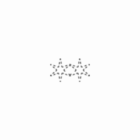

  
  <h1>Are.na Snip</h1>

This Chrome extension, built with Manifest V3, includes screenshot snipping features that expand upon the official Are.na browser extension.

## Image Handling

Due to limitations in the official Are.na API (which doesn't support direct image uploads or posting), this extension uses a workaround via Cloudflare Workers and R2 storage. Images uploaded through this process are temporary, thanks to an object lifecycle policy on the R2 bucket that automatically deletes them after a set time.

1. A pre-signed upload URL is requested from the Cloudflare Worker.
2. The image is uploaded to the R2 bucket.
3. A pre-signed fetch URL is generated.
4. The URL is passed to Are.na's "post block" endpoint, allowing you to post the image.

## Bugs & Feature Requests
If you encounter any bugs or have feature requests, please open an issue in this repository.